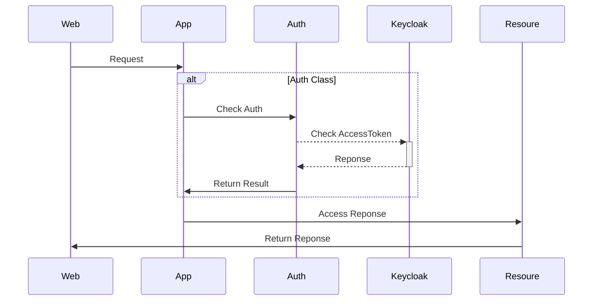

# POC Django Rest Framework and Keycloak Integration
## 🎯 **What is it?**  
POC Django Rest Framework and Keycloak Integration

## 📚 **Purpose**  
To learn and demonstrate the **OAuth2 Authorization Code Flow** using Keycloak.

## 🛠️ **Features**
__KeycloakAuthentication class__



---

## 🚀 Getting Started

1. Deploy and Setup Keycloak 

```docker-compose.yml
services:
  # PostgreSQL Database Service
  # - Stores all Keycloak data (users, realms, clients)
  # - Must be started before Keycloak
  # - Connected to Keycloak via keycloak-network
  # - Data persisted through postgres_data volume
  postgres:
    image: postgres:15
    container_name: keycloak-postgres
    environment:
      POSTGRES_DB: ${KC_DB_NAME}
      POSTGRES_USER: ${KC_DB_USERNAME}
      POSTGRES_PASSWORD: ${KC_DB_PASSWORD}
    volumes:
      - postgres_data:/var/lib/postgresql/data
    healthcheck:
      test: ["CMD", "pg_isready", "-U", "keycloak"]
      interval: 10s
      timeout: 5s
      retries: 5
    networks:
      - keycloak-network

  # Keycloak Authentication Server
  # - Provides OAuth2/OpenID Connect functionality
  # - Depends on PostgreSQL for data storage
  # - Accessible on port 8080
  # - Connected to PostgreSQL via keycloak-network
  # - Configured for development mode with HTTP enabled
  keycloak:
    image: quay.io/keycloak/keycloak:latest
    container_name: keycloak
    environment:
      KC_DB: postgres
      KC_DB_URL: jdbc:postgresql://postgres:5432/${KC_DB_NAME}
      KC_DB_USERNAME: ${KC_DB_USERNAME}
      KC_DB_PASSWORD: ${KC_DB_PASSWORD}
      KEYCLOAK_ADMIN: ${KEYCLOAK_ADMIN}
      KEYCLOAK_ADMIN_PASSWORD: ${KEYCLOAK_ADMIN_PASSWORD}
      KC_HOSTNAME_STRICT: false
      KC_HOSTNAME_STRICT_HTTPS: false
      KC_HTTP_ENABLED: true
    command:
      - start-dev
    ports:
      - "8880:8080"
    depends_on:
      postgres:
        condition: service_healthy
    networks:
      - keycloak-network

volumes:
  postgres_data:
    name: keycloak_postgres_data

networks:
  keycloak-network:
    name: keycloak-network
```

2. Create a `.env` file with the following variables:
```.env
# ============ main settings ============
# run the following command to generate a random secret key:
# python -c 'from django.core.management.utils import get_random_secret_key; print(get_random_secret_key())'
DJANGO_SECRET_KEY=
DJANGO_ALLOWED_HOSTS=localhost,127.0.0.1

# ============ CORS settings ============
CORS_ALLOW_CREDENTIALS=
CORS_ALLOWED_ORIGINS=
CSRF_TRUSTED_ORIGINS=

# ============ Keycloak settings ============
KEYCLOAK_URL=
KEYCLOAK_REALM=
KEYCLOAK_CLIENT_ID=
KEYCLOAK_CLIENT_SECRET=
KEYCLOAK_ADMIN_USERNAME=
KEYCLOAK_ADMIN_PASSWORD=
```

3. initial pyhon env and active environment
```bash
> poetry install
> eval $(poetry env activate)
```

4. Run migration at first time and run app:

```bash
> python manage.py migrate
> python manage.py runserver 0.0.0.0:8000
```

5. Test by Postman: [collection](drf-keycloak-poc.postman_collection.json) or Frontend: [next-oauth-code-poc](https://github.com/nuttapat-swd/next-oauth-code-poc)